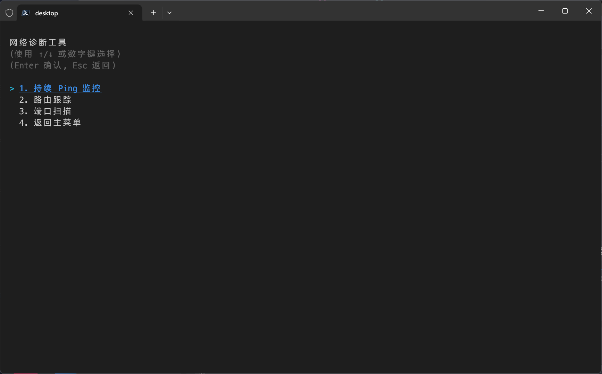

# ipTools - 一个 C# 网络命令行工具集

ipTools 是一个使用 C# 编写的、功能丰富的网络命令行小工具，旨在为用户提供一个现代化且易于使用的界面来执行常见的网络配置和诊断任务。此工具利用 Spectre.Console 库构建美观的交互式界面，并集成了多种网络实用功能。

## 功能特性

- **网络适配器管理**:
    - **查看适配器信息**: 自动检测并展示所有可用的网络适配器，包括虚拟适配器，并高亮显示当前的活动连接。
    - **配置静态 IP**: 为选定的网络适配器设置静态 IP 地址、子网掩码、默认网关和 DNS 服务器。
    - **启用 DHCP**: 快速将网络适配器设置为通过 DHCP 自动获取 IP 地址和 DNS 服务器。

- **公网信息查询**:
    - **获取公网 IP**: 启动时自动从 `ipinfo.io` 获取并显示用户的公网 IP 地址、地理位置（国家、地区、城市）和运营商信息。

- **局域网扫描**:
    - **设备发现**: 基于活动网络适配器的 IP 和子网掩码，扫描整个局域网以发现所有在线设备。
    - **详细信息解析**: 对于发现的设备，工具会尝试获取其 MAC 地址（通过 ARP 缓存）和主机名（通过 DNS 解析）。
    - **高亮本机**: 在扫描结果中以不同颜色和样式突出显示本机信息，便于识别。

- **网络诊断工具**:
    - **持续 Ping**: 对指定 IP 地址或域名执行连续的 Ping 测试，并实时显示延迟、TTL 和丢包率统计。
    - **路由跟踪 (Traceroute)**: 跟踪到目标主机的数据包路径，显示每一跳的 IP 地址、延迟和主机名。
    - **端口扫描**: 扫描指定 IP 地址的单个端口、多个端口或端口范围，以检测开放的 TCP 端口。

## 功能展示

|         主菜单         |       选择适配器       |         设置IP         |
| :--------------------: | :--------------------: | :--------------------: |
|  |  |  |
|     **局域网扫描**     |      **诊断工具**      |      **扫描进度**      |
|  |  |  |
|      **端口扫描**      |      **路由跟踪**      |      **持续PING**      |
|  |  |  |

## 如何使用

### 前提条件
- **操作系统**: Windows
- **.NET**: .NET 8.0
- **权限**: 由于该工具需要修改网络设置（例如更改 IP 地址），因此必须以**管理员权限**运行。

### 启动应用
1.  构建并运行项目。
2.  应用启动后将显示主菜单，其中包含所有主要功能选项。
3.  使用键盘的 `↑` `↓` 键或数字键进行选择，按 `Enter` 确认，或按 `Esc` 返回或退出。

### 菜单选项
- **配置网络适配器 IP**: 进入二级菜单，可选择具体的网络适配器，然后为其配置静态 IP 或切换到 DHCP。
- **扫描局域网设备**: 自动选择活动网络接口进行局域网扫描，并以表格形式展示结果。
- **网络诊断工具**: 进入诊断工具子菜单，可选择 Ping、路由跟踪或端口扫描功能。
- **退出程序**: 关闭应用程序。

## 项目结构与依赖

该项目是一个基于 .NET 8.0 的控制台应用程序。

- **解决方案文件**: `ipTools.sln`
- **项目文件**: `ipTools.csproj`
- **主程序**: `Program.cs`

### 主要依赖包
- **Spectre.Console (v0.49.1)**: 用于构建丰富的交互式控制台界面，如图表、进度条、表格等。
- **DnsClient (v1.7.0)**: 一个功能强大的 DNS 解析客户端库，用于异步查询主机名等信息。

## 许可证
该项目根据 **GNU General Public License v3.0** 进行许可。详细信息请参阅 `LICENSE` 文件。